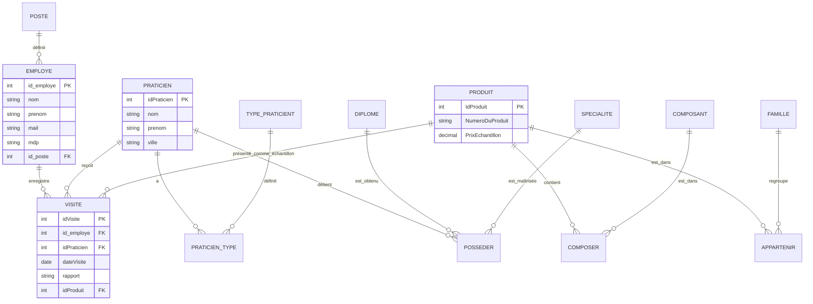

# 💊 PharmaSI

> Application de bureau (WinForms) pour la gestion d'un laboratoire pharmaceutique, développée en **C# / .NET**, avec authentification, consultation de produits, gestion des praticiens et saisie de rapports de visites.

---

## ✨ Fonctionnalités

| Fonctionnalité | Description |
|---|---|
| 🔐 **Authentification** | Connexion sécurisée des employés (Visiteurs, Responsables, Délégués). |
| 📦 **Gestion Produits** | Consultation détaillée du catalogue des médicaments et échantillons. |
| 🧑‍⚕️ **Consultation Praticiens** | Liste et détails des médecins et spécialistes partenaires. |
| 📝 **Saisie Rapports** | Enregistrement des comptes-rendus de visites avec gestion des échantillons offerts. |
| 📊 **Historique** | Visualisation des visites passées par l'utilisateur connecté. |

---

## 🗂️ Structure du projet

L'application suit désormais une architecture **MVC (Modèle-Vue-Contrôleur)** :

```
PharmaSISuperTest/
├── Controllers/            # Logique métier et décisions navigation
│   ├── LoginController.cs  # Authentification & Sessions
│   └── ProductController.cs # Gestion produits & Navigation
├── Models/                 # Objets de données (POCO)
│   ├── Employee.cs
│   ├── Product.cs
│   └── Visite.cs
├── Services/               # Accès aux données (ADO.NET / MySQL)
│   ├── EmployeeService.cs
│   └── ProductService.cs
├── Helpers/                # Utilitaires (Sécurité, etc.)
│   └── SecurityHelper.cs   # Hachage SHA256
├── Views/ (Forms)          # Interface utilisateur (WinForms)
│   ├── Login.cs            # Page de connexion
│   ├── Home.cs             # Tableau de bord principal
│   └── Produit.cs          # Catalogue produits
└── PharmaSISuperTest.csproj # Configuration projet Visual Studio
```

---

## 🗄️ Base de données

### Schéma Relationnel (ERD)



### Détails du Schéma

| Table | Description |
|---|---|
| `employe` | Utilisateurs de l'application (Visiteurs, Délégués, etc.) |
| `visite` | Comptes-rendus des visites effectuées auprès des praticiens |
| `praticien` | Médecins et spécialistes partenaires |
| `produit` | Médicaments et échantillons du laboratoire |
| `famille` | Catégories de produits (Antalgiques, etc.) |
| `composant` | Substances actives contenues dans les produits |
| `diplome` | Titres académiques détenus par les praticiens |
| `specialite` | Domaines d'expertise des médecins |

---

## ⚙️ Installation

### Prérequis

- **Visual Studio 2019/2022** avec le module ".NET Desktop Development"
- **XAMPP** (pour MySQL)
- MySQL Connector/NET (inclus via NuGet)

### Étapes

1. **Importer la base de données** :
   - Ouvrir [phpMyAdmin](http://localhost/phpmyadmin)
   - Créer une base nommée **`pharmasi`**
   - Importer le fichier `pharmasi.sql` à la racine.

2. **Configuration** :
   - Vérifier la chaîne de connexion dans `Services/EmployeeService.cs` (par défaut `Server=127.0.0.1;Uid=root;Pwd=;`).

3. **Lancer le projet** :
   - Ouvrir `PharmaSISuperTest.sln` dans Visual Studio.
   - Appuyer sur **F5** ou "Démarrer".

---

## 🔑 Comptes de test

| Email | Mot de passe | Rôle |
|:---|---|---|
| `toto@example.com` | `toto123` | Visiteur |
| `alice@pharmasi.test` | `alice123` | Responsable |
| `luc@pharmasi.test` | `luc123` | Délégué |
| `sophie.petit@pharmasi.test` | `sophie123` | Secrétaire |

---

## 🛠️ Technologies utilisées

- **Langage** : C# 
- **Framework** : .NET Framework 4.7.2
- **UI** : Windows Forms
- **Base de données** : MySQL 8.0 / MariaDB
- **Sécurité** : SHA-256 pour les mots de passe

---

## 🏗️ Architecture MVC

L'application a été refactorisée pour assurer une séparation stricte :
- **Contrôleur** : Valide les entrées et pilote la navigation.
- **Modèle** : Représente les entités et gère la persistance via les Services.
- **Vue** : Formulaires allégés gérant uniquement l'affichage et les événements UI.

---

## 📄 Licence

Projet scolaire — usage libre à des fins pédagogiques.
